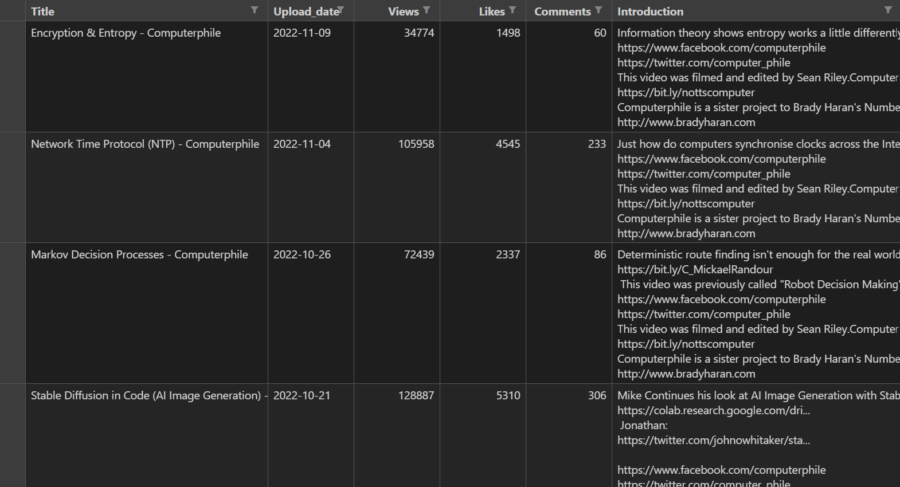

# INFO300 Term Project

## Group Members and Student IDs

- Zhengyang Yu: 320200945951
- Jishen Hu: 320200930961
- Chuanshi Wang: 320200945921

## 1. Introduction

### 1.1 Data Source

Computerphile is a channel on the video site YouTube that introduces computer science. In each of its videos, a computer science scholar is invited to explain and analyze some interesting or important issues in the field.  
On the YouTube video play page, the title, upload date, number of views, likes, comments, and a brief description of the video are displayed, which gives us a general idea of the content and quality (popularity) of the video.  
Therefore, using a Web scraping tool, we can build a data set with the theme "Computerphile's lectures uploaded to YouTube", and after filtering, there are 747 legal data items corresponding to the lectures. Using this data, we will try to help viewers find more lectures they need.

### 1.2 Project Architecture

The project consists of three main components: the ElasticSearch search engine, the web backend, and the web frontend.  
We build a Web crawler using Scrapy and Selenium to collect needed data from YouTube, and then upload the data to the ElasticSearch search engine and index it.  
When a request from a user reaches the web backend, the web backend embeds the request into a pre-written ElasticSearch query, calls the ElasticSearch Python API to send the query to the ElasticSearch search engine, and processes the results returned by the search engine into a form usable for the web frontend.  
The final appearance of the web page presented to the user is controlled by the web front-end, and this part needs to be adjusted to include the trade-offs of the content presented in the web page, the style of the web page, and the logic of the web page operations.

### 1.3 Division of Work

- Zhengyang Yu: Front-end programming, Flask back-end programming, evaluating system performance, calculating MAP
- Jishen Hu: Recorded data, Flask back-end programming, video recording, algorithm optimization
- Chuanshi Wang: data collection, data cleaning, writing ElasticSearch queries

## 2. Data Collection

### 2.1 Tools Introduction

We use a Web scraping tool Scrapy to obtain the data needed for the project from the Internet. Since the website we want to crawl, YouTube, uses JavaScript to render pages dynamically, the HTML returned by the website does not contain most of the information presented in the web page. To solve the problem of getting dynamic webpage content, we utilized Selenium.  
Selenium is an automated testing tool that can be used to drive the browser with Python code to perform clicks, dropdowns, and other actions to trigger some callbacks in the web page to render the desired content; after rendering, the Python program can also get the loaded HTML through Selenium, thus solving the problem of getting content from dynamic web pages. With the help of Selenium to load dynamic pages, Scrapy can handle the content in dynamic pages as if they were static pages.

### 2.2 Codes and Explanation

In order to create a Scrapy project, it is needed to run the following command firstly:

```shell
scrapy startproject computerphile
```

In order to make the project run, it is needed to create the file `computerphile.py` in the `spider` directory, which defines `ComputerphileSpider`, the subclass of `scrapy.Spider` and Spider needed for this crawling task. `computerphile.py` contains the following contents:

```python
import re
import time
import scrapy
from selenium import webdriver
from scrapy.http import HtmlResponse
from selenium.webdriver.common.by import By
from selenium.webdriver.common.keys import Keys


class ComputerphileSpider(scrapy.Spider):
    name = "computerphile"

    def start_requests(self):
        # Create Browser Object
        option = webdriver.ChromeOptions()
        chrome_prefs = dict()
        option.experimental_options["prefs"] = chrome_prefs
        chrome_prefs["profile.default_content_settings"] = {"images": 2}
        chrome_prefs["profile.managed_default_content_settings"] = {"images": 2}
        browser = webdriver.Chrome(options=option)

        # Access home page and drop down to load all needed elements
        main_page_url = "https://www.youtube.com/user/Computerphile/videos"
        browser.get(main_page_url)
        while True:
            time.sleep(1)
            browser.find_element(By.TAG_NAME, 'body').send_keys(Keys.END)
            page = HtmlResponse(url=main_page_url, body=browser.page_source.encode())
            load_ring = page.css("#contents > ytd-continuation-item-renderer")
            if len(load_ring) == 0:
                break

        # Get video URLs on the homepage and crawl them one by one
        main_page_response = HtmlResponse(url=main_page_url, body=browser.page_source.encode())
        videos = main_page_response.css("#video-title-link::attr(href)")
        yield from main_page_response.follow_all(videos)
        browser.close()

    def parse(self, response, **kwargs):
        # Get video title
        title = response.css("#title > h1 > yt-formatted-string::text").get()

        # Get upload time and the number of views
        tooltip = response.css("#tooltip::text").getall()
        views_and_date = [x for x in tooltip if '次观看' in x][0]
        views_date_pair = views_and_date.split('•')
        # Get the number of views
        views = int("".join(re.findall("[0-9]+", views_date_pair[0])))
        # Get upload time
        upload_date = "-".join(map(lambda x: x if len(x) >= 2 else '0' + x, re.findall("[0-9]+", views_date_pair[1])))

        # Get the number of likes
        likes_str = response.css(
            "#segmented-like-button > "
            "ytd-toggle-button-renderer > "
            "yt-button-shape > button > "
            "div.cbox.yt-spec-button-shape-next--button-text-content > "
            "span::text").get()
        try:
            likes = int(likes_str)
        except ValueError:
            likes = int(float(likes_str[:-1]) * 10000)

        # Get the number of comments
        comments = int(''.join(response.css("#count > yt-formatted-string > span:nth-child(1)::text").get().split(',')))

        # Get video introduction
        intro_raw = response.css("#description-inline-expander > yt-formatted-string *::text").getall()
        intro_reduced = map(lambda x: x.replace('\n', '').replace('\r', ''), intro_raw)
        intro_list = [x for x in intro_reduced if len(x)]
        introduction = '\n'.join(intro_list)

        # Build a complete item
        result = {
            "title": title,
            "upload_date": upload_date,
            "views": views,
            "likes": likes,
            "comments": comments,
            "introduction": introduction
        }
        return result
```

`ComputerphileSpider` has two class methods: `start_requests` and `parse`. The `start_requests` is a generator function that, after accessing Computerphile's YouTube homepage, uses Selenium to control the browser to continuously scroll down the page to load all the videos, and then gets the URLs of all Computerphile's contributed videos from the completely loaded page to provide to the Scheduler for subsequent download and processing. `parse` is used to process the response from Downloader Middlewares, which parses the content in the response into `dict` form and returns it, and will be used by Item Pipeline to generate the data we finally collect.  
As mentioned earlier, because of dynamic rendering, the content contained in the response passed to `parse` is loaded with the help of Selenium. In Scrapy, this can be achieved by writing a Downloader Middleware that contains the logic to call Selenium for loading, which means that the following code needs to be added to the file middlewares.py to create the `ComputerphileMiddleware` class, which means adding the following code to the file:

```python
import time
from selenium import webdriver
from scrapy.http import HtmlResponse
from selenium.webdriver.common.by import By
from selenium.webdriver.common.keys import Keys
from selenium.webdriver.support.ui import WebDriverWait
from selenium.webdriver.support import expected_conditions as EC


class ComputerphileMiddleware:
    def __init__(self):
        option = webdriver.ChromeOptions()
        chrome_prefs = dict()
        option.experimental_options["prefs"] = chrome_prefs
        chrome_prefs["profile.default_content_settings"] = {"images": 2}
        chrome_prefs["profile.managed_default_content_settings"] = {"images": 2}
        self.browser = webdriver.Chrome(options=option)

    def __del__(self):
        self.browser.close()

    def process_request(self, request, spider):
        # Access the video detail page
        url = request.url
        self.browser.get(url)

        time.sleep(1)

        # Expand and load introduction of video
        show_intro = self.browser.find_element("css selector", "#expand")
        show_intro.click()

        # Scroll down to load comments
        self.browser.find_element(By.TAG_NAME, 'body').send_keys(Keys.END)
        wait = WebDriverWait(self.browser, 120)
        wait.until(
            EC.presence_of_element_located((By.CSS_SELECTOR, "#count > yt-formatted-string > span:nth-child(1)")))

        # Return page contents
        response_body = self.browser.page_source.encode()
        response = HtmlResponse(url=url, body=response_body)
        return response
```

Downloader Middleware receives requests from the Scheduler and gives the corresponding response to the `parse` method of the Spider, which shows that its core logic is precisely the `process_request` method, which uses Selenium to call the browser to access the URL contained in the request, control the browser to render the needed content, and obtain the rendered page HTML, which is wrapped into an `HtmlResponse` object and returned.  
In order for `ComputerphileMiddleware` to take effect, the following is required in settings.py:

```python
DOWNLOADER_MIDDLEWARES = {
   'computerphile.middlewares.ComputerphileMiddleware': 543,
}
```

Run the following command to crawl all video information of Computerphile, and the crawl results will be saved in the file computerphile.csv:

```shell
scrapy crawl computerphile -O computerphile.csv
```

And the crawling result would be like:


## 3. Baseline IR System

### 3.1 Imported data into elasticsearch

Once the data was processed, we started building the backend of the site, and the first step was to put the cleaned data into elasticsearch.  
We configured elasticsearch and kibana locally, and started two separate programs.  
The port number of elasticsearch is `9200` and the port number of kibana is `5601`. Then just put the data file in `Upload a file`.

### 3.2 Build the backend with flask

We separate the front-end and back-end of this project, the back-end is mainly responsible for receiving the `keyword` from the front-end and finding the valid information in elastic search according to different algorithms and then sending it back to the front-end after some processing.  
To accomplish this task, we created a file called `search.py`. The main interface `home` is responsible for inputting the information to be found, and the sub-interface `results` is responsible for displaying the output results.  
The algorithm part will be improved later, and only one algorithm is shown here.  
The code is as follows:

```python
from flask import Flask
from flask import request
from flask import render_template
from elasticsearch import Elasticsearch

app = Flask(__name__,  static_url_path='/static')

'''Main Interface'''
@app.route('/')
def home():
    return render_template('home.html')

es = Elasticsearch(
    ["127.0.0.1"],
    port=9200,
    sniff_on_start=True,  
    sniff_on_connection_fail=True,  
    sniff_timeout=60  
)


'''Results Interface'''
@app.route('/search', methods=['get'])
def search():
    keywords = request.args.get('keywords')

    query1 =  {
    "query": {
        "multi_match": {
        "query": keywords,
        "fields": [
            "title",
            "introduction"
      ]
    }
  }
}

'''Extracting and packaging information from elasticsearch'''
    res = es.search(index="results3", body=query1)
    info = res['hits']['hits']
    print(res)
    hits = len(info)
    Data = [] 
    for i in range(hits):
        tit = info[i]['_source']['title']
        intro = info[i]['_source']['introduction']
        update = info[i]['_source']['upload_date']
        data = {'title':tit,'introduction':intro,'date':update}
        Data.append(data)
'''Send to front-end'''
    return render_template("results.html", HITS=hits, Data=Data, keywords=keywords)
```

### 3.3 Build the front end with HTML and CSS

The front-end is written in HTML and CSS, and the folder structure (including the Flask back-end) is as follows.
```
project
│   search.py
└───static
│   │   listview.css
│   │   style.css
|
└───templates
     |   result.html
     |   search.html
```

The running process is as follows. First we need to start search.py (as explained in 3.2), and then the program will automatically call search.html.

```html
<head>
    <link rel="stylesheet" type="text/css" href="../static/style.css">
</head>

<div class="container">
    <form action="/result" method="get" class="parent"> 
        <input type="text" id="keywords" name="keywords" placeholder="Search something">
        <input type="submit" type="button" value="Just LZU It">
    </form>
</div>
```

search.html will use style.css

```css
/*This is style.css*/
body {
    width: 100%;
    height: 100vh;
    background: rgb(240,239,243);
    margin:auto;
    display: flex;
    align-items: center;
    justify-content: center;
}

.container {
    width: 95%;
    height: 90%;
    margin: 100px auto;
    background: #fff;
    border-radius: 15px;
    box-shadow: 4px 4px 30px rgba(0, 0, 0, 0.06);
}

.parent {
    width: 100%;
    height: 42px;
    top: 40px;
    left: 0px;
    position: relative;
    /*border: 1px solid #ccc;*/
}

.parent>input:first-of-type {
    width: 38%;
    height: 100%;
    border: 1px solid #ccc;
    font-size: 16px;
    padding-left:10px;
    outline: none;
    left: 26%;
    position: relative;
}

.parent>input:first-of-type:focus {
    border: 1px solid #317ef3;
    padding-left: 10px;
}

.parent>input:last-of-type {
    width: 10%;
    height: 100%;
    position: absolute;
    background: #317ef3;
    border: 1px solid #317ef3;
    color: #fff;
    font-size: 16px;
    outline: none;
    top: 2.5%;
    left: 25.5%;
    position: relative;
}
```


When the user enters content and clicks search, search.py will automatically run result.html. In this html file, we embed python loop code that can be recognized by Flask, so that as many results as the backend returns, as many search items will appear on the frontend

```html
<!This file is result.html>
<html lang="en">
<head>
    <meta charset="UTF-8">
    <title>Title</title>
    
    <link rel="stylesheet" href="../static/listView.css">
</head>
<body>

<div id="mainContentDiv">

    <div class="mainDivMainImgDiv" >
        <div class="headLeftDiv headLeftDivFont">Search Results</div>
        <div class="link-top"></div>
        <div class="headLineBlowDiv">
            <div class="headLeftDiv">
                Hit<span>【{{HITS}}】</span>results
            </div>
        </div>
    </div>

    <div class="mainDivMainInfoiv">
        <div class="mainInfoSubDiv">
            
                <div class="mainDIvMainInfoDivSubInfoDiv" >
                    <div class="mainDivMainInfoiv_HeadTextDiv " >
                        <div class="mainDivMainInfoiv_HeadTextDiv_TextBox cardInfoTitle findKey" >
                            {{item['title']}}
                        </div>
                    </div>
                    <div class="mainDivMainInfoiv_mainTextDiv  findKey">
                        {{item['introduction']}}
                    </div>
                    <div class="InfoDiv_Right_2 rightFlexFont">
                        {{item['date']}}
                    </div>
                </div>
            
        </div>
    </div>
</div>
</body>
</html>
```

reuslt.html will also use listview.css

```css
/*This file is listview.css*/
body {
    background: whitesmoke;
}

#mainContentDiv {
    position: absolute;
    width: 70%;
    height: 100%;
    background: whitesmoke;
    top: 10%;
    left: 10%;
}

.mainDivMainImgDiv {
    position: absolute;
    width: 100%;
    height: 120px;
    background: white;
}

.mainDivMainInfoiv {
    position: absolute;
    width: 100%;
    height: 100%;
    background: whitesmoke;
    top: 130px;
}

.mainInfoSubDiv{
    position: relative;
    width: 100%;
    height: 100%;
    background: whitesmoke;
    overflow-y: auto;
    overflow-x: hidden;
}

.headLeftDiv {
    position: absolute;
    width: 50%;
    height: 100%;
    left: 4%;
    top: 25%;
}

.headLeftDivFont {
    font-weight: 500;
    /*line-height: 58px;*/
    font-size: 20px;
    color: #333;
}

.headRightDiv {
    position: absolute;
    width: 40%;
    height: 100%;
    right: 2%;
    top: 20%;
}

.link-top {
    position: absolute;
    top: 60%;
    left: 4%;
    width: 90%;
    height: 1px;
    border-top: solid #e8edf3 1px;
}

.headLineBlowDiv {
    position: absolute;
    top: 63%;
    height: 40%;
    width: 100%;
}

.mainDIvMainInfoDivSubInfoDiv {
    position: relative;
    width: 100%;
    height: 13%;
    background: white;
    border: 1px solid #eaeaea;
}

.mainDIvMainInfoDivSubInfoDiv:hover {
    background: rgba(0, 0, 0, 0.05);
}

.mainDivMainInfoiv_HeadTextDiv {
    position: absolute;
    top: 10%;
    left: 4%;
    width: 30%;
    height: 30%;
    background: rgba(0, 0, 0, 0);

}

.mainDivMainInfoiv_mainTextDiv {
    position: absolute;
    top: 52%;
    left: 4%;
    width: 80%;
    background: rgba(0, 0, 0, 0);
    overflow: hidden;
    text-overflow:ellipsis;
    display:-webkit-box;
    -webkit-box-orient:vertical;
    -webkit-line-clamp:2;
    font-size: 12px;
    color: rgb(102, 102, 102);
}

.mainDivMainInfoiv_HeadTextDiv_TextBox {
    position: absolute;
    top: 25%;
    width: 100%;
    height: 50%;
    background: rgba(0, 0, 0, 0);
}

.cardInfoTitle {
    font-weight: 700;
    /*color: #1f264d;*/
    height: 22px;
    display: inline-block;
    max-width: 600px;
    overflow: hidden;
    text-overflow: ellipsis;
    white-space: nowrap;
    cursor: pointer;
}

.rightFlexFont {
    color: #b3b3b3;
    font-weight: 500;
    text-align: right;
    font-size: 12px;
    color: rgb(179, 179, 179);
}

.InfoDiv_Right_2 {
    position: absolute;
    top: 55%;
    right: 2%;
    width: 18%;
    height: 30%;
    background: rgba(0, 0, 0, 0);
}
```

User finally see the results


### 3.4 Search work correctly

In this project, we are using the `Flask` framework. This is a lightweight web application framework written in python.  
First, run the following command to set up the `Flask` runtime environment:

```shell
set FLASK_EVN=development
```

Next, run the following command to bring in the Python file you just wrote.

```shell
set FLASK_APP=server.py
```

Finally, run the following command to run `Flask`:

```shell
flask run
```

Enter the query in the interface, for example `python game`, and return the search results.

## 4. Enhanced IR System

### 4.1 optimization 1: Number of Likes
For a video site, in addition to keywords, there is an important indicator. That is the quality of the video itself, which is not directly retrievable by search engines. So we have created a new algorithm that uses **likes** as an evaluation indicator.  

At the same time, in order to consider the search balance. We conducted several tests and finally came up with the following calculation:
```json
"source": "_score + saturation(doc['likes'].value, 10000) * 5"
```
And the overall algorithm is as follows:
```json
{
  "query": {
    "script_score": {
      "query": {
        "multi_match": {
          "query": "Python game",
          "fields": [
            "title",
            "introduction"
          ]
        }
      },
      "script": {
        "source": "_score + saturation(doc['likes'].value, 10000) * 5"
      }
    }
  }
}
```


### 4.2 optimization 2: Number of useful Likes
When we thought about it further, we found that the **Likes** metric could also be a case of swiping likes in order to improve the search ranking. Therefore, we used the number of likes as a percentage of the number of people who have seen the video as an important metric as well. After several tests, we finally came up with the following calculation:
```json
 "source": "_score + saturation(doc['likes'].value, 10000) * 3 / saturation(doc['views'].value, 500000)"
```
And the overall algorithm is as follows:
```json

{
  "query": {
    "script_score": {
      "query": {
        "multi_match": {
          "query": "Python game",
          "fields": [
            "title",
            "introduction"
          ]
        }
      },
      "script": {
        "source": "_score + saturation(doc['likes'].value, 10000) * 3 / saturation(doc['views'].value, 500000)"
      }
    }
  }
}

```
## 5. Evaluation and Comparison

### 5.1 Run different queries and make relevant judgments for the top 10 hits

*We create a table for each query, each table contains information about the search results of different systems. 1 means the search results are relevant, 0 means the search results are not relevant*

**Search query: Information search**

| Rank | system1 | system2 | system3 |
| ---- | ------- | ------- | ------- |
| 1    | 0       | 0       | 0       |
| 2    | 1       | 0       | 0       |
| 3    | 1       | 0       | 0       |
| 4    | 0       | 0       | 1       |
| 5    | 0       | 0       | 0       |
| 6    | 0       | 0       | 0       |
| 7    | 0       | 0       | 1       |
| 8    | 0       | 0       | 0       |
| 9    | 1       | 1       | 0       |
| 10   | 0       | 1       | 0       |

**Search query: Python game**

| Rank | system1 | system2 | system3 |
| ---- | ------- | ------- | ------- |
| 1    | 1       | 1       | 1       |
| 2    | 1       | 1       | 1       |
| 3    | 0       | 0       | 0       |
| 4    | 1       | 1       | 1       |
| 5    | 0       | 0       | 0       |
| 6    | 0       | 0       | 0       |
| 7    | 0       | 0       | 0       |
| 8    | 0       | 0       | 0       |
| 9    | 0       | 0       | 0       |
| 10   | 0       | 0       | 0       |

**Search query: Web security**

| Rank | system1 | system2 | system3 |
| ---- | ------- | ------- | ------- |
| 1    | 1       | 0       | 0       |
| 2    | 1       | 0       | 0       |
| 3    | 0       | 1       | 1       |
| 4    | 1       | 1       | 0       |
| 5    | 0       | 0       | 1       |
| 6    | 0       | 1       | 0       |
| 7    | 1       | 0       | 0       |
| 8    | 1       | 1       | 0       |
| 9    | 1       | 1       | 1       |
| 10   | 1       | 0       | 0       |

**Search query: Machine learing**

| Rank | system1 | system2 | system3 |
| ---- | ------- | ------- | ------- |
| 1    | 1       | 1       | 1       |
| 2    | 1       | 1       | 1       |
| 3    | 1       | 1       | 1       |
| 4    | 1       | 0       | 0       |
| 5    | 0       | 0       | 1       |
| 6    | 0       | 0       | 1       |
| 7    | 1       | 1       | 1       |
| 8    | 0       | 0       | 0       |
| 9    | 1       | 0       | 0       |
| 10   | 1       | 1       | 0       |

**Search query: Information**

| Rank | system1 | system2 | system3 |
| ---- | ------- | ------- | ------- |
| 1    | 1       | 1       | 1       |
| 2    | 1       | 1       | 1       |
| 3    | 0       | 0       | 0       |
| 4    | 0       | 0       | 0       |
| 5    | 0       | 0       | 0       |
| 6    | 0       | 0       | 0       |
| 7    | 0       | 0       | 0       |
| 8    | 0       | 0       | 0       |
| 9    | 0       | 0       | 0       |
| 10   | 0       | 0       | 0       |

**Search query: Big data**

| Rank | system1 | system2 | system3 |
| ---- | ------- | ------- | ------- |
| 1    | 1       | 1       | 1       |
| 2    | 1       | 1       | 1       |
| 3    | 1       | 1       | 1       |
| 4    | 0       | 1       | 1       |
| 5    | 1       | 0       | 1       |
| 6    | 0       | 1       | 0       |
| 7    | 1       | 0       | 0       |
| 8    | 0       | 0       | 0       |
| 9    | 0       | 0       | 1       |
| 10   | 0       | 0       | 0       |


### 5.2 Compare the results across 3 systems

+ **Our queries cover a wide range of channels**
+ **System 1's search yielded the most results**
+ **System 3 tends to search for results that System 1 and System 2 can't**
+ **The performance of system 2 is relatively mediocre, the relevance, breadth and priority of search results are not as good as system 1 and system 2**
+ **However, on some of the more explicit queries, the three systems performed surprisingly well together**


### 5.3 Calculate MAP for each of the queries on each system

*For the sake of accuracy, automation, we wrote a Python code to calculate MAP*

```python
def MAP(sequence):
    '''
    input: Boolean Sequence
    output: MAP value
    '''
    sum=0
    result=0
    count=0
    for times,item in enumerate(sequence):
        sum+=item
        if item==1:
            count+=1
            result+=sum/(times+1)
    print(result/count)
```

**MAP matrix:**

| Query              | System1       | System2       | System3       |
| ------------------ | ------------- | ------------- | ------------- |
| Information search | 0.500         | 0.160         | 0.268         |
| Python game        | 0.917         | 0.917         | 0.917         |
| Web security       | 0.759         | 0.478         | 0.356         |
| Machine learning   | 0.869         | 0.814         | 0.915         |
| Information        | 1.000         | 1.000         | 1.000         |
| Big data           | 0.903         | 0.967         | 0.944         |
|                    | 0.825（mean） | 0.723（mean） | 0.734（mean） |


### 5.4 Discuss and report the comparison results

+ The calculated MAP results are similar to the human-perceived results when we collected the data at the beginning
  + Among the three systems, system 1 performs the best, followed by system 2, and system 3 performs average
+ However, from the MAP data, we can also see the different characteristics of the three systems
  + System 1 is characterized by being very stable, with better prediction results in most problems
  + Systems 2 and 3 are characterized by the fact that in some problems, their search results are much better than the other two systems
+ Combining the MAP calculations and the conclusions of 5.2
  + System 1 is suitable for most of the searches and can be used as a baseline
  + System 3 is suitable for use when the other two systems return single results, and it can often search for results that are not searched by the other systems but are very relevant.
  + Systems 2 and 3, which we have improved, are better at searching for certain hot issues and can be used as a complement to System 1